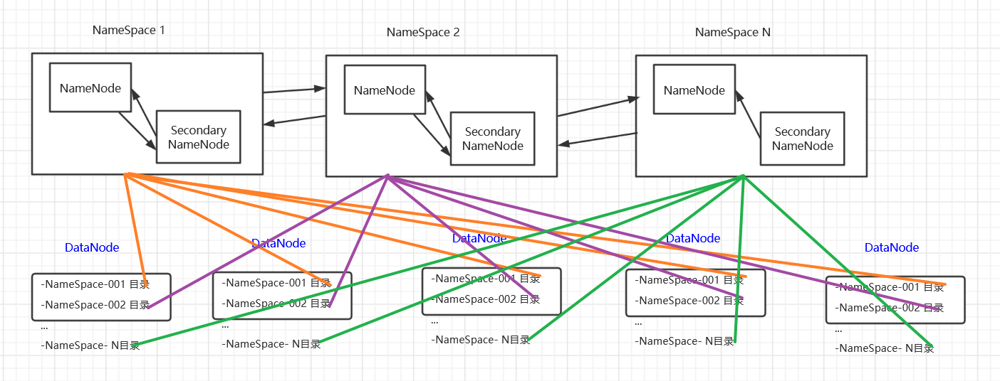
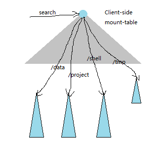
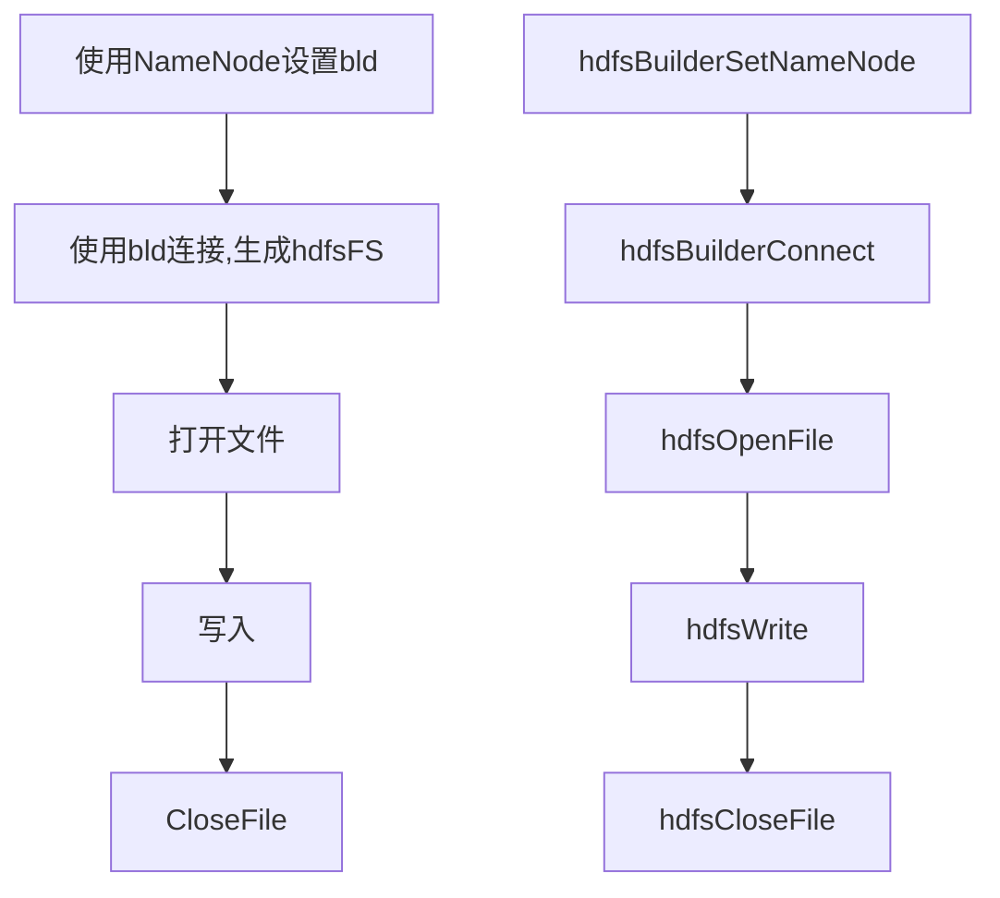

# HDFS调研

## 目的

Hadoop分布式文件系统(HDFS)被设计成适合运行在通用硬件(commodity hardware)上的分布式文件系统。它和现有的分布式文件系统有很多共同点。但同时，它和其他的分布式文件系统的区别也是很明显的。HDFS是一个高度容错性的系统，适合部署在廉价的机器上。HDFS能提供高吞吐量的数据访问，非常适合大规模数据集上的应用。HDFS放宽了一部分POSIX约束，来实现流式读取文件系统数据的目的。HDFS在最开始是作为Apache Nutch搜索引擎项目的基础架构而开发的。HDFS是Apache Hadoop Core项目的一部分。这个项目的地址是https://hadoop.apache.org/core/。

## 概述

HDFS是Hadoop应用用到的一个最主要的分布式存储系统。一个HDFS集群主要由一个NameNode和很多个Datanode组成：Namenode管理文件系统的元数据，而Datanode存储了实际的数据。HDFS的体系结构在[这里](https://hadoop.apache.org/docs/r1.0.4/cn/hdfs_design.html)有详细的描述。本文档主要关注用户以及管理员怎样和HDFS进行交互。[HDFS架构设计](https://hadoop.apache.org/docs/r1.0.4/cn/hdfs_design.html)中的[图解](https://hadoop.apache.org/docs/r1.0.4/cn/images/hdfsarchitecture.gif)描述了Namenode、Datanode和客户端之间的基本的交互操作。基本上，客户端联系Namenode以获取文件的元数据或修饰属性，而真正的文件I/O操作是直接和Datanode进行交互的。

下面列出了一些多数用户都比较感兴趣的重要特性。

- Hadoop（包括HDFS）非常适合在商用硬件（commodity hardware）上做分布式存储和计算，因为它不仅具有容错性和可扩展性，而且非常易于扩展。[Map-Reduce](https://hadoop.apache.org/docs/r1.0.4/cn/mapred_tutorial.html)框架以其在大型分布式系统应用上的简单性和可用性而著称，这个框架已经被集成进Hadoop中。
- HDFS的可配置性极高，同时，它的默认配置能够满足很多的安装环境。多数情况下，这些参数只在非常大规模的集群环境下才需要调整。
- 用Java语言开发，支持所有的主流平台。
- 支持类Shell命令，可直接和HDFS进行交互。
- NameNode和DataNode有内置的Web服务器，方便用户检查集群的当前状态。
- 新特性和改进会定期加入HDFS的实现中。下面列出的是HDFS中常用特性的一部分：
  - 文件权限和授权。
  - 机架感知（Rack awareness）：在调度任务和分配存储空间时考虑节点的物理位置。
  - 安全模式：一种维护需要的管理模式。
  - fsck：一个诊断文件系统健康状况的工具，能够发现丢失的文件或数据块。
  - Rebalancer：当datanode之间数据不均衡时，平衡集群上的数据负载。
  - 升级和回滚：在软件更新后有异常发生的情形下，能够回滚到HDFS升级之前的状态。
  - Secondary Namenode：对文件系统名字空间执行周期性的检查点，将Namenode上HDFS改动日志文件的大小控制在某个特定的限度下。

## HDFS架构组成

### Namenode 和 Datanode

HDFS采用master/slave架构。一个HDFS集群是由一个Namenode和一定数目的Datanodes组成。Namenode是一个中心服务器，负责管理文件系统的名字空间(namespace)以及客户端对文件的访问。集群中的Datanode一般是一个节点一个，负责管理它所在节点上的存储。HDFS暴露了文件系统的名字空间，用户能够以文件的形式在上面存储数据。从内部看，一个文件其实被分成一个或多个数据块，这些块存储在一组Datanode上。Namenode执行文件系统的名字空间操作，比如打开、关闭、重命名文件或目录。它也负责确定数据块到具体Datanode节点的映射。Datanode负责处理文件系统客户端的读写请求。在Namenode的统一调度下进行数据块的创建、删除和复制。


### 文件系统的名字空间 (namespace)

HDFS支持传统的层次型文件组织结构。用户或者应用程序可以创建目录，然后将文件保存在这些目录里。文件系统名字空间的层次结构和大多数现有的文件系统类似：用户可以创建、删除、移动或重命名文件。当前，HDFS不支持用户磁盘配额和访问权限控制，也不支持硬链接和软链接。但是HDFS架构并不妨碍实现这些特性。

Namenode负责维护文件系统的名字空间，任何对文件系统名字空间或属性的修改都将被Namenode记录下来。应用程序可以设置HDFS保存的文件的副本数目。文件副本的数目称为文件的副本系数，这个信息也是由Namenode保存的。

### Secondary NameNode

NameNode将对文件系统的改动追加保存到本地文件系统上的一个日志文件（edits）。当一个NameNode启动时，它首先从一个映像文件（fsimage）中读取HDFS的状态，接着应用日志文件中的edits操作。然后它将新的HDFS状态写入（fsimage）中，并使用一个空的edits文件开始正常操作。因为NameNode只有在启动阶段才合并fsimage和edits，所以久而久之日志文件可能会变得非常庞大，特别是对大型的集群。日志文件太大的另一个副作用是下一次NameNode启动会花很长时间。

Secondary NameNode定期合并fsimage和edits日志，将edits日志文件大小控制在一个限度下。因为内存需求和NameNode在一个数量级上，所以通常secondary NameNode和NameNode运行在不同的机器上。Secondary NameNode通过bin/start-dfs.sh在conf/masters中指定的节点上启动。

Secondary NameNode的检查点进程启动，是由两个配置参数控制的：

- fs.checkpoint.period，指定连续两次检查点的最大时间间隔， 默认值是1小时。
- fs.checkpoint.size定义了edits日志文件的最大值，一旦超过这个值会导致强制执行检查点（即使没到检查点的最大时间间隔）。默认值是64MB。

Secondary NameNode保存最新检查点的目录与NameNode的目录结构相同。 所以NameNode可以在需要的时候读取Secondary NameNode上的检查点镜像。

如果NameNode上除了最新的检查点以外，所有的其他的历史镜像和edits文件都丢失了， NameNode可以引入这个最新的检查点。以下操作可以实现这个功能：

- 在配置参数dfs.name.dir指定的位置建立一个空文件夹；
- 把检查点目录的位置赋值给配置参数fs.checkpoint.dir；
- 启动NameNode，并加上-importCheckpoint。

NameNode会从fs.checkpoint.dir目录读取检查点， 并把它保存在dfs.name.dir目录下。 如果dfs.name.dir目录下有合法的镜像文件，NameNode会启动失败。 NameNode会检查fs.checkpoint.dir目录下镜像文件的一致性，但是不会去改动它。

命令的使用方法请参考[secondarynamenode 命令](https://hadoop.apache.org/docs/r1.0.4/cn/commands_manual.html#secondarynamenode).

## HDFS 联邦模式

### 背景


HDFS 有两个主要层：

- 命名空间

  - 由目录、文件和块组成。
  - 它支持所有与命名空间相关的文件系统操作，如创建、删除、修改和列出文件和目录。

- 块存储服务

  ，它有两个部分：

  - 块管理（在 Namenode 中执行）
    - 通过处理注册和定期心跳来提供 Datanode 集群成员资格。
    - 处理块报告并维护块的位置。
    - 支持创建、删除、修改、获取区块位置等区块相关操作。
    - 管理副本放置、复制不足的块的复制，并删除复制过度的块。
  - 存储 - 由 Datanodes 通过在本地文件系统上存储块并允许读/写访问来提供。

  之前的 HDFS 架构只允许整个集群使用一个命名空间。在该配置中，单个 Namenode 管理命名空间。HDFS 联盟通过向 HDFS 添加对多个 Namenodes/命名空间的支持来解决此限制。

  
### **联邦机制**

  当集群大到一定程度的时候，NameNode进程使用的内存可能会达上百G，NameNode就成为了性能的瓶颈，所以HDFS提出NameNode水平扩展方案，即联邦机制（Federation).这个时候一个NameNode和SecondaryNode就看作是一个整体，即一个NameSpace。

  - 多个NameNode共用一个集群的资源，每台NameNode都可以单独对外提供服务
  - 每个NameNode都会定义一个存储池，有单独的ID，每个DataNode都为所有存储池提供存储，具体见于每个DataNode都会有单独的目录存储不同NameNode的数据，例如：NameNode-01目录、NameNode-02目录、NameNode-03目录...
  - DataNode     会按照存储池id向其对应的NameNode汇报块信息，例如NameNode-01目录向NameNode1汇报等。同时DataNode会向所有的NameNode汇报本地存储可用资源情况。

  Federation的不足：由于Federation并没有完全解决单点故障问题，所以每个NameNode都跟单点部署一样需要配置SecondaryNameNode来辅助恢复还原挂掉的NameNode元数据信息。

  所以一般集群规模很大的时候，就会采用HA（高可用）+Federation(联邦)的部署方案，也就是每个联合的NameNode（NameSpace）都是HA的。

  

### 多个命名节点/命名空间

为了横向扩展名称服务，联邦使用多个独立的 Namenodes/namespace。Namenodes 是联合的；Namenodes 是独立的，不需要相互协调。Datanodes 被所有 Namenodes 用作块的公共存储。每个 Datanode 向集群中的所有 Namenode 注册。Datanodes 定期发送心跳和块报告。它们还处理来自 Namenodes 的命令。

用户可以使用[ViewF](https://hadoop.apache.org/docs/stable/hadoop-project-dist/hadoop-hdfs/ViewFs.html)来创建个性化的命名空间视图。ViewFs 类似于某些 Unix/Linux 系统中的客户端挂载表。


**块池**

块池是属于单个命名空间的一组块。Datanodes 为集群中的所有块池存储块。每个 Block Pool 都是独立管理的。这允许命名空间为新块生成块 ID，而无需与其他命名空间协调。Namenode 故障不会阻止 Datanode 为集群中的其他 Namenode 提供服务。

命名空间及其块池一起称为命名空间卷。它是一个独立的管理单元。当一个 Namenode/namespace 被删除时，Datanodes 对应的区块池也被删除。在集群升级期间，每个命名空间卷都作为一个单元升级。

**集群ID**

甲**丛集编号**标识用于识别该集群中的所有节点。格式化 Namenode 时，会提供或自动生成此标识符。此 ID 应用于将其他 Namenode 格式化到集群中。

### 命名空间管理

 Federation中存在多个命名空间，在Federation中采用"文件名hash"的方法，因为该方法的locality非常差，

比如：某个目录下的文件，采用"文件名hash"的方法，这些文件可能会被放到不同的namespace中，hdfs要访问所有的namespace，代价太大。

为了方便管理多个命名空间，HDFS Federation采用了经典的Client Side Mount Table



  下面四个深色的三角代表4个独立的命名空间，上方的灰色三角形代表从客户角度去访问的子命名空间。

各个深色的命名空间mount到灰色的表中，客户端可以通过不同的挂载点来访问不同的命名空间，如同linux系统中访问不同挂载点一样。这就是federation的基本原理：将各个命名空间挂载到全局mount-table中，就可以将数据全局共享，同样的命名空间挂载到个人的mount-table中，就成为应用程序可见的命名空间视图

## API使用

官方API示例：

```c
#include "hdfs.h" 

int main(int argc, char **argv) {

    hdfsFS fs = hdfsConnect("default", 0);
    const char* writePath = "/tmp/testfile.txt";
    hdfsFile writeFile = hdfsOpenFile(fs, writePath, O_WRONLY|O_CREAT, 0, 0, 0);
    if(!writeFile) {
          fprintf(stderr, "Failed to open %s for writing!\n", writePath);
          exit(-1);
    }
    char* buffer = "Hello, World!";
    tSize num_written_bytes = hdfsWrite(fs, writeFile, (void*)buffer, strlen(buffer)+1);
    if (hdfsFlush(fs, writeFile)) {
           fprintf(stderr, "Failed to 'flush' %s\n", writePath); 
          exit(-1);
    }
   hdfsCloseFile(fs, writeFile);
}
```


示例中connect传入参数为default，系统会去配置文件读取默认配置进行连接。

实际使用可能的流程，及所调用的API接口名称




